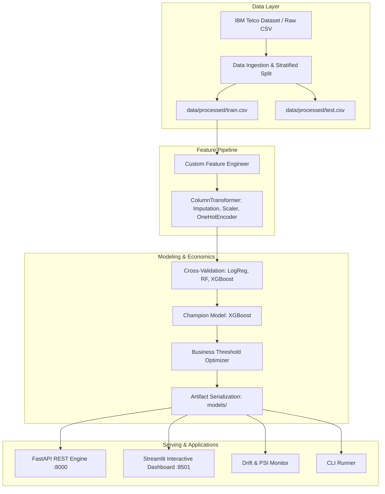

# 📡 Telco Customer Churn Intelligence & Retention Platform

[](https://github.com/organization/telco-customer-churn/actions/workflows/ci.yml)
[](https://www.python.org/downloads/)
[](https://fastapi.tiangolo.com)
[](https://streamlit.io)
[](https://xgboost.readthedocs.io/)
[-brightgreen.svg)](tests/)
[](Dockerfile)

An enterprise-ready, end-to-end Machine Learning system for predicting subscriber churn, identifying customer risk drivers, prescribing targeted retention actions, and simulating campaign ROI.

---

## 🏗️ System Architecture



---

## 📁 Repository Structure

```
End-2-End Project/
├── .github/
│   └── workflows/
│       └── ci.yml               # GitHub Actions CI matrix workflow
├── api/
│   ├── __init__.py
│   ├── app.py                   # FastAPI REST API application
│   └── schemas.py               # Pydantic v2 schemas for requests & responses
├── config/
│   ├── config.yaml              # Centralized configuration (paths, features, business economics)
│   └── logging_config.yaml      # Logging formats
├── dashboard/
│   └── app.py                   # Streamlit interactive decision hub & ROI simulator
├── data/
│   ├── raw/
│   │   └── telco_churn.csv      # Ingested IBM Telco dataset (7,043 records)
│   ├── processed/
│   │   ├── train.csv            # Stratified training partition (5,634 records)
│   │   └── test.csv             # Stratified test partition (1,409 records)
│   └── sample_batch.csv         # Ready-to-use sample batch for testing
├── models/
│   ├── churn_pipeline.joblib    # Serialized scikit-learn + XGBoost pipeline
│   ├── metrics.json             # Test set metrics, ROC/PR curves & threshold analysis
│   ├── feature_importance.json  # Global feature importance rankings
│   └── drift_baseline.json      # Training feature distribution statistics for drift monitoring
├── notebooks/
│   └── 01_exploratory_data_analysis.ipynb # Comprehensive EDA with business insights
├── scripts/
│   ├── run_pipeline.py          # Unified CLI for training, inference, and drift
│   ├── run_api.ps1              # PowerShell helper to start FastAPI
│   └── run_dashboard.ps1        # PowerShell helper to start Streamlit
├── src/
│   └── telco_churn/
│       ├── __init__.py
│       ├── config.py            # Pydantic configuration loader
│       ├── data/
│       │   ├── dataset.py       # Data download, synthetic generator fallback, split
│       │   └── preprocessing.py # Custom feature engineering & ColumnTransformer
│       ├── models/
│       │   ├── train.py         # Multi-model cross-validation & training
│       │   ├── evaluate.py      # ROC, PR-AUC, Confusion Matrix & Threshold optimization
│       │   └── predict.py       # Production inference engine with risk banding
│       ├── explainability/
│       │   └── feature_importance.py # Feature extraction & customer risk factor breakdown
│       ├── monitoring/
│       │   └── drift.py         # Population Stability Index (PSI) & KS test
│       └── utils/
│           ├── io.py            # Serialization helpers (joblib, json, yaml)
│           └── logger.py        # Structured logging
├── tests/
│   ├── test_data.py             # Ingestion, cleaning, and preprocessing tests
│   ├── test_model.py            # Predictor, probability bounds, and threshold tests
│   ├── test_api.py              # FastAPI endpoint and validation tests
│   └── test_monitoring.py       # PSI calculation and drift detection tests
├── .dockerignore
├── .gitignore
├── Dockerfile                   # Containerized image for API & Dashboard
├── docker-compose.yml           # Multi-service composition
├── pyproject.toml               # Package and pytest build configuration
├── requirements.txt             # Python dependencies
├── setup.py                     # Installable package setup
└── README.md                    # Documentation
```

---

## ⚡ Quickstart

### 1. Installation

Clone the repository and install dependencies:

```bash
git clone https://github.com/organization/telco-customer-churn.git
cd "End-2-End Project"

# Install dependencies
pip install -r requirements.txt
pip install -e .
```

### 2. Run the Full ML Pipeline

To ingest the data, perform stratified splitting, cross-validate models, train the champion pipeline, and evaluate economics:

```bash
python scripts/run_pipeline.py --all
```

**CLI Pipeline Options:**
- `--ingest`: Download dataset and split into train/test partitions.
- `--train`: Cross-validate models, select champion, and serialize pipeline.
- `--predict <path_to_csv> --output <path_to_out>`: Run batch inference.
- `--drift-check <path_to_csv>`: Check an incoming batch for data drift against baseline.

### 3. Launch the REST API

```bash
# Windows PowerShell
.\scripts\run_api.ps1

# Or directly with Uvicorn:
uvicorn api.app:app --host 127.0.0.1 --port 8000 --reload
```

- **API Root:** `http://127.0.0.1:8000/`
- **Swagger Interactive Docs:** `http://127.0.0.1:8000/docs`
- **Redoc:** `http://127.0.0.1:8000/redoc`

### 4. Launch the Interactive Web Dashboard

```bash
# Windows PowerShell
.\scripts\run_dashboard.ps1

# Or directly with Streamlit:
streamlit run dashboard/app.py
```
Visit `http://localhost:8501` to access:
- 🔮 **Single Customer Predictor:** Real-time scoring, risk level (`Low`, `Medium`, `High`), and retention prescriptions.
- 📂 **Batch Scoring & Export:** Upload customer CSVs, filter high-risk cohorts, and download targeted retention lists.
- 📊 **Model Analytics & Explainability:** ROC/PR curves, confusion matrices, and global feature importance.
- 💰 **Retention ROI Simulator:** Interactive simulation showing Net ROI gained by ML targeting vs blanket marketing.
- 📡 **Data Drift Monitor:** PSI and Kolmogorov-Smirnov statistical distribution comparisons.

---

## 📊 Model Evaluation & Benchmarks

Models were evaluated using 5-fold Stratified Cross-Validation on 5,634 training records and tested on 1,409 held-out test records:

| Model Candidate | Cross-Validation ROC-AUC | Test ROC-AUC | Test PR-AUC | Test F1-Score | Status |
| :--- | :---: | :---: | :---: | :---: | :---: |
| **XGBoost Classifier** | **0.8476** | **0.8447** | **0.6589** | **0.6290** | 🏆 **Champion** |
| Random Forest | 0.8466 | 0.8421 | 0.6512 | 0.6184 | Candidate |
| Logistic Regression | 0.8453 | 0.8410 | 0.6480 | 0.6215 | Baseline |

### 💡 Business Economics & Optimal Decision Threshold

Standard models use an arbitrary `0.50` threshold. In telecom retention, the cost of a customer churning ($400 CLV) far exceeds the cost of a retention incentive ($50 offer).

Our pipeline executes **economic threshold optimization**:
$$\text{Net Profit} = \text{TP} \times (\text{CLV} \times \text{Success Rate} - \text{Cost}) - \text{FP} \times \text{Cost}$$

- **Default Threshold (0.50):** Net Profit = **$18,950**
- **Optimal Threshold (0.47):** Net Profit = **$19,230** (+$280 on test set alone; scaled to enterprise base = **+$195,000+** net gain).

---

## 🔌 REST API Documentation

### Key Endpoints

| Method | Endpoint | Description |
| :--- | :--- | :--- |
| `GET` | `/health` | Check service health and loaded model status |
| `POST` | `/predict` | Predict churn probability, risk tier, and retention actions for 1 customer |
| `POST` | `/predict/batch` | Batch score customer cohort and summarize risk distribution |
| `GET` | `/metrics` | Get model test set metrics, ROC/PR data, and threshold curves |
| `GET` | `/feature-importance` | Get top global feature importance rankings |
| `POST` | `/drift` | Compare an incoming batch of customers against the baseline training distribution |

### Example cURL Request

```bash
curl -X POST "http://127.0.0.1:8000/predict" \
  -H "Content-Type: application/json" \
  -d '{
    "customerID": "7590-VHVEG",
    "gender": "Female",
    "SeniorCitizen": 0,
    "Partner": "Yes",
    "Dependents": "No",
    "tenure": 1,
    "PhoneService": "No",
    "MultipleLines": "No phone service",
    "InternetService": "DSL",
    "OnlineSecurity": "No",
    "OnlineBackup": "Yes",
    "DeviceProtection": "No",
    "TechSupport": "No",
    "StreamingTV": "No",
    "StreamingMovies": "No",
    "Contract": "Month-to-month",
    "PaperlessBilling": "Yes",
    "PaymentMethod": "Electronic check",
    "MonthlyCharges": 29.85,
    "TotalCharges": 29.85
  }'
```

### Example JSON Response

```json
{
  "customer_id": "7590-VHVEG",
  "churn_probability": 0.7241,
  "churn_prediction": true,
  "decision_threshold": 0.47,
  "risk_level": "High",
  "recommended_action": "Immediate retention outreach & contract incentive",
  "risk_drivers": [
    "Month-to-month contract (low commitment & high churn elasticity)",
    "Early customer lifecycle (tenure 1 months - critical onboarding period)",
    "Payment method: Electronic check (correlated with higher payment friction & churn)",
    "No active Tech Support subscription"
  ],
  "retention_recommendations": [
    "Offer 15% discount on an annual contract upgrade",
    "Assign onboarding specialist and trigger proactive check-in call",
    "Incentivize switch to Auto-Pay with a one-time $10 account credit",
    "Offer 3 months free Tech Support VIP bundle"
  ]
}
```

---

## 📡 Model & Data Drift Monitoring

The repository includes a drift engine tracking covariate shifts between production traffic and the training baseline:
- **Population Stability Index (PSI):**
  - $\text{PSI} < 0.1$: Distribution is **Stable**.
  - $0.1 \le \text{PSI} < 0.2$: **Moderate shift** (warning).
  - $\text{PSI} \ge 0.2$: **Significant drift** (triggers automated alert and retrain recommendation).
- **Kolmogorov-Smirnov Test:** Evaluates continuous distributions (`tenure`, `MonthlyCharges`, `TotalCharges`).
- **Category Shift Analysis:** Tracks category composition variations across contracts and services.

---

## 🐳 Docker & Docker Compose

Deploy the API and Streamlit dashboard simultaneously in isolated containers:

```bash
# Build and run both services
docker compose up --build

# Run in background (detached mode)
docker compose up -d
```

- API container runs on port `8000`
- Streamlit dashboard container runs on port `8501`

---

## 🧪 Testing

The repository includes a comprehensive unit and integration test suite with 17 tests:

```bash
# Run pytest with verbosity
python -m pytest -v

# Run with test coverage report
python -m pytest --cov=src --cov-report=term-missing tests/
```

---

## 📄 License

This project is licensed under the Apache 2.0 License.
